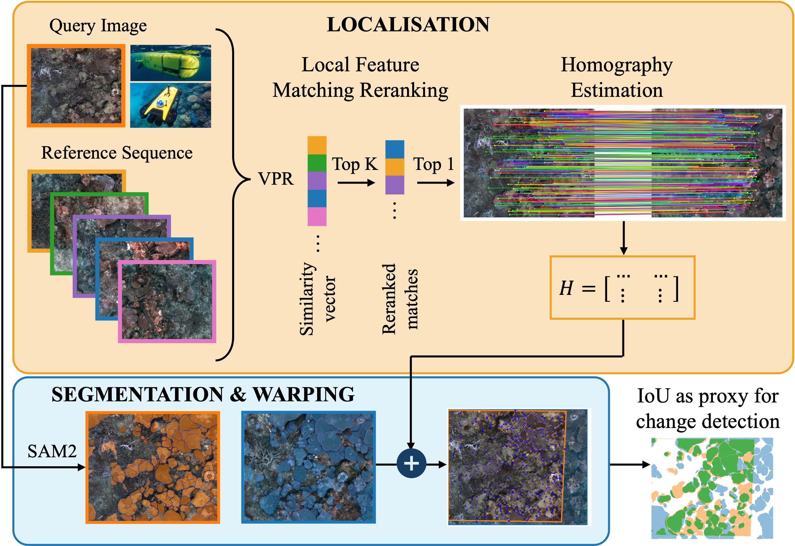
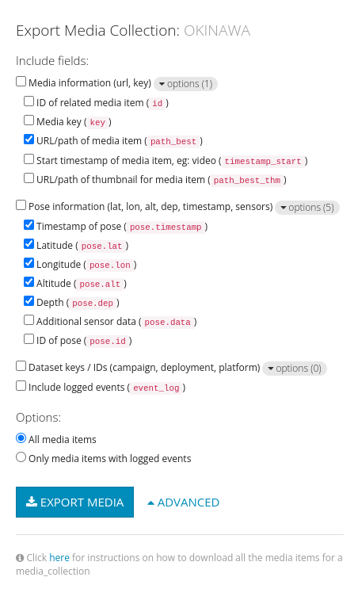

<p align="center">

  <h1 align="center"> UnderLoc
  <h3 align="center">Image-Based Relocalization and Alignment for Long-Term Monitoring of Dynamic Underwater Environments</h3> 
  </h1>
  <p align="center">
    <a href="https://github.com/bev-gorry"><strong>Beverley Gorry</strong></a>
    ·
    <a href="https://scholar.google.com/citations?hl=en&user=eq46ylAAAAAJ"><strong>Tobias Fischer</strong></a>
    ·
    <a href="https://scholar.google.com/citations?user=TDSmCKgAAAAJ&hl=en"><strong>Michael Milford</strong></a>
    .
    <a href="https://scholar.google.com/citations?user=SDtnGogAAAAJ&hl=en"><strong>Alejandro Fontan</strong></a>
  </p>



**UnderLoc** is an integrated pipeline that combines Visual Pace Recognition (VPR), feature matching, and image segmentation on video-derived images. This method enables robust identification of revisited areas, estimations of rigid transformations, and downstream analysis of ecosystem changes. Furthermore, we introduce the **SQUIDLE+ VPR Benchmark**—the first large-scale underwater VPR benchmark designed to leverage an extensive collection of unstructured data from multiple robotic platforms, spanning time intervals from days to years. The dataset encompasses diverse trajectories, arbitrary overlap and diverse seafloor types captured under varying environmental conditions, including differences in depth, lighting, and turbidity.

This repository contains code for the paper "Image-Based Relocalization and Alignment for Long-Term Monitoring of Dynamic Underwater Environments."

<!-- The article can be found on <a href="">arXiv</a>. -->

## Getting Started

We use the package management tool [**pixi**](https://pixi.sh/latest/). If you haven't installed [**pixi**](https://pixi.sh/latest/) yet, run the following command in your terminal:

```bash
curl -fsSL https://pixi.sh/install.sh | bash
```

_After installation, restart your terminal or source your shell for the changes to take effect_. For more details, refer to the [**pixi documentation**](https://pixi.sh/latest/).

Clone the repository and navigate to the project directory:

```bash
git clone https://github.com/bev-gorry/underloc.git && cd underloc
```

## Quick Demo

```bash
COMING SOON
```

## Add a SQUIDLE+ Dataset

Datasets in the benchmark are stored in a folder named **SQUIDLE-VPR-BENCHMARK**, which is created by default in the same parent directory as **underloc**.

1. To add a new dataset, visit [**SQUIDLE+**](https://squidle.org/geodata/explore?action=newcollection#map) and add your sequences to a new collection. Export the collection as a CSV file, ensuring that the export options are as follows:



2. Place the CSV file into the folder **~/underloc/datasets/squidle_csv** and adjust the corresponding YAML configuration file **~/underloc/arguments/args_dataset.yaml**.

3. Run the bash script **./run_dataset.sh** to create the dataset in the benchmark. Your dataset will be created with the following structure:

```
~/SQUIDLE-VPR-BENCHMARK
└── YOUR_DATASET
    └── sequence_01
        ├── rgb
            └── img_01
            └── img_02
            └── ...
        ├── calibration.yaml
        ├── groundtruth.csv
        ├── groundtruth.txt
        └── rgb.txt
    └── sequence_02
        ├── ...
    └── ...
```

This dataset structure is designed to replicate [**VSLAM-LAB**](https://github.com/alejandrofontan/VSLAM-LAB), so that the same sequences can be used to test the extensive range of SLAM baselines available.

<!-- ## License
**UnderLoc** is released under a **LICENSE.txt**. For a list of code dependencies which are not property of the authors of **UnderLoc**, please check **docs/Dependencies.md**. -->

## Included Repositories

The following forked repositories are included in **UnderLoc** to enable evaluation of VPR methods, local feature matching, and semantic segmentation.

- [VPR-methods-evaluation](https://github.com/gmberton/VPR-methods-evaluation)
- [LightGlue](https://github.com/cvg/LightGlue)
- [SAM2](https://github.com/facebookresearch/sam2)

## Citation

Thanks for using our work. You can cite it as:

```bibtex
CITATION WILL BE AVAIALABLE ONCE THE PAPER IS SHARED ON ARXIV
```

We also encourage citing [VPR-methods-evaluation](https://github.com/gmberton/VPR-methods-evaluation), [MegaLoc](https://arxiv.org/abs/2502.17237), [LightGlue](https://github.com/cvg/LightGlue), and [SAM2](https://github.com/facebookresearch/sam2).

## Acknowledgements

This research was partially supported by funding from ARC Laureate Fellowship FL210100156 to MM and ARC DECRA Fellowship DE240100149 to TF. The authors acknowledge continued support from the Queensland University of Technology (QUT) through the Centre for Robotics.

We would particularly like to acknlowedge the authors of [VPR-methods-evaluation](https://github.com/gmberton/VPR-methods-evaluation), [MegaLoc](https://arxiv.org/abs/2502.17237), [LightGlue](https://github.com/cvg/LightGlue), [SAM2](https://github.com/facebookresearch/sam2), and [VSLAM-LAB](https://github.com/alejandrofontan/VSLAM-LAB).
